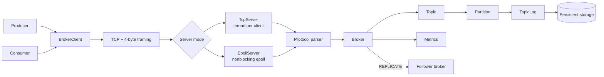
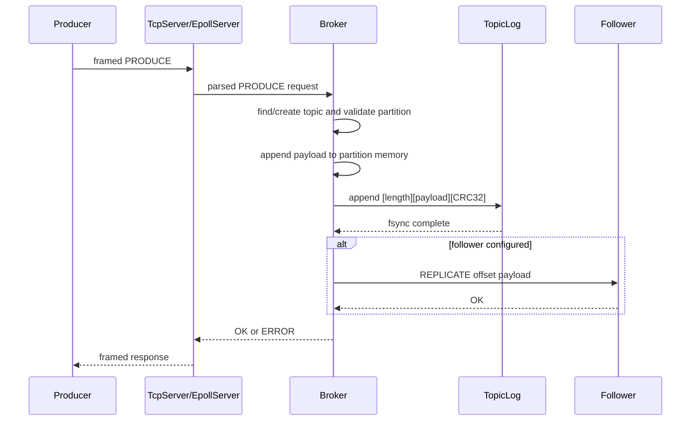
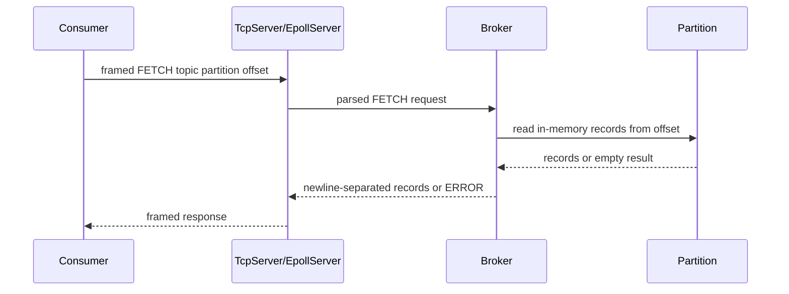
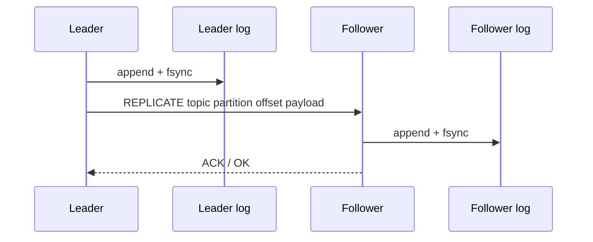
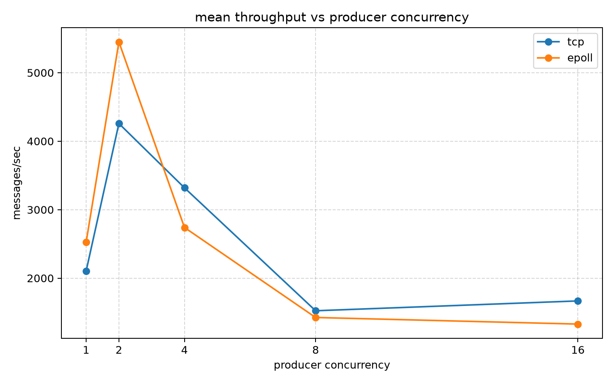
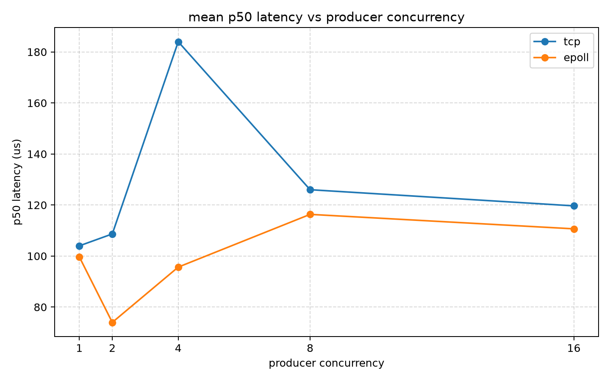
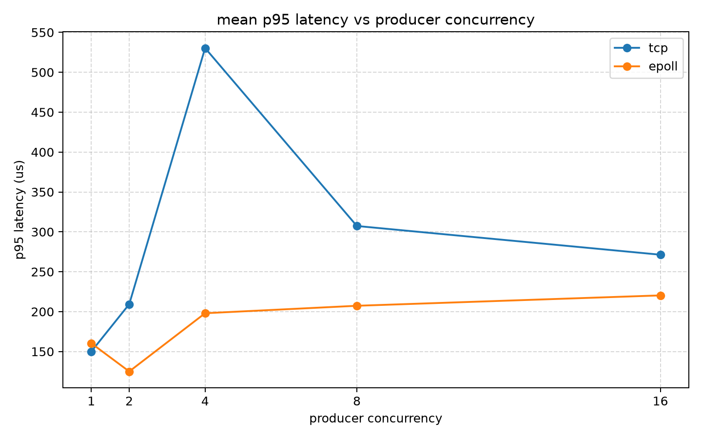
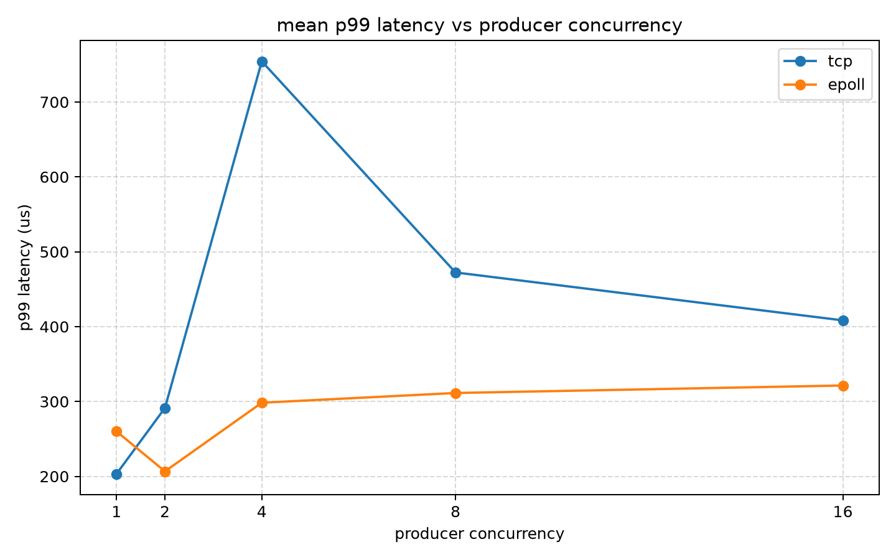

# Kafka-Inspired Message Broker

A Kafka-inspired message broker implemented in C++17 to explore core backend and systems concepts: TCP networking, length-prefixed framing, protocol parsing, append-only partition logs, crash recovery, consumer groups, concurrent request handling, Linux `epoll`, simplified leader/follower replication, broker metrics, and reproducible benchmarking. This is not a Kafka clone or Kafka-wire-compatible broker; it is a deliberately scoped systems project that implements the major mechanics from first principles.

## Project Highlights

- Custom TCP request/response protocol with 4-byte length-prefixed framing.
- Text protocol supporting `PRODUCE`, `FETCH`, consumer-group commands, replication commands, `PING`, and `METRICS`.
- Persistent append-only per-partition logs.
- Record format with payload length, payload bytes, and CRC32 validation.
- Startup recovery with incomplete/corrupt final-record truncation.
- Producer and consumer client programs.
- Consumer groups with deterministic partition assignment and in-memory committed offsets.
- Concurrent request handling through a thread-per-client TCP server.
- Linux nonblocking event-driven server using `epoll`.
- Simplified leader/follower replication with progress tracking, catch-up, and manual promotion.
- In-memory broker metrics and a reproducible TCP-vs-epoll benchmark suite.

## Architecture



The networking layer reconstructs framed requests, the protocol layer parses text commands, and the `Broker` owns topics, partitions, consumer groups, replication state, and metrics. Records are persisted through `TopicLog` using append-only partition files.

See [docs/architecture.md](docs/architecture.md) for the detailed architecture.

## Key Design Concepts

| Concept | Implementation |
| --- | --- |
| TCP networking | POSIX sockets with request/response over persistent connections. |
| Binary framing | 4-byte big-endian payload length followed by payload bytes. |
| Protocol parsing | Text commands parsed into typed `Request` values. |
| Append-only storage | One log file per topic partition. |
| Offsets | Zero-based message index within a partition. |
| Partitions | Three fixed partitions per topic: `0`, `1`, and `2`. |
| Consumer groups | `JOIN`, `GROUP_POLL`, `FETCH`, `COMMIT`, `LEAVE` workflow. |
| Concurrency | Shared broker state protected by mutexes. |
| epoll | Alternative nonblocking server with per-client read/write buffers. |
| CRC32 | Record checksum over serialized length bytes plus payload bytes. |
| Recovery | Startup log scan, CRC validation, trailing invalid-record truncation. |
| Replication | Simplified synchronous leader/follower `REPLICATE` path. |
| Observability | Request counters, bytes processed, latency percentiles, CSV metrics. |

## PRODUCE / FETCH Flow

### PRODUCE



### FETCH



More detailed request lifecycle diagrams are in [docs/architecture.md](docs/architecture.md).

## Storage

Each persistent record is stored as:

```text
[4-byte big-endian payload length][payload bytes][4-byte big-endian CRC32]
```

Storage is append-only and partition-scoped:

```text
data/
└── <topic>/
    ├── partition-0.log
    ├── partition-1.log
    └── partition-2.log
```

`TopicLog::append()` writes the serialized record with POSIX file APIs and calls `fsync()` before returning. On startup, the broker scans partition logs, validates CRCs, rebuilds in-memory topic state, and truncates incomplete or corrupt trailing bytes to the last valid record boundary.

See [docs/storage_recovery_semantics.md](docs/storage_recovery_semantics.md) for storage, recovery, and delivery semantics.

## Consumer Groups

Consumers can join a group for a topic. The broker assigns partitions deterministically by sorting consumer IDs and round-robin assigning partitions `0`, `1`, and `2`.

The consumer-group flow is:

```text
JOIN -> GROUP_POLL -> FETCH -> COMMIT -> repeat -> LEAVE
```

`GROUP_POLL` returns assignment rows containing topic, partition, and committed offset. `COMMIT` stores the next offset in memory under the group/topic/partition. Offsets are not persisted across broker restart, so the project demonstrates at-least-once-style behavior rather than exactly-once delivery.

## Replication

The project includes a simplified leader/follower replication model:



The follower tracks replication progress per topic partition. A leader can query `REPLICATION_PROGRESS`, send missing records for catch-up, and then replicate new records. Manual promotion is available through `Broker::promote_to_leader()`.

This is intentionally not Raft, quorum consensus, automatic leader election, or automatic failover. It is a scoped replication model for understanding leader/follower data flow and recovery boundaries.

## Networking Modes

### TcpServer

`TcpServer` is the default server path. It uses blocking sockets and one detached thread per client. Each client thread reads framed requests, parses them, delegates to `Broker`, writes framed responses, and cleans up consumer-group memberships on disconnect.

### EpollServer

`EpollServer` is selected with `--epoll`. It uses nonblocking sockets, `epoll_create1()`, `epoll_ctl()`, `epoll_wait()`, per-client `read_buffer`, per-client `write_buffer`, and `EPOLLIN`/`EPOLLOUT` readiness handling.

Both server modes share the same protocol parser, broker logic, storage, replication, and metrics. This makes the Stage 11 TCP-vs-epoll benchmark a comparison of networking models over the same broker behavior.

## Build + Run

The project uses Linux/POSIX networking APIs. The commands below assume a Linux shell or WSL.

Build the broker and C++ test targets:

```bash
cmake -S . -B build
cmake --build build
```

Build the producer and consumer client programs:

```bash
g++ -std=c++17 -Isrc clients/producer.cpp -o build/producer
g++ -std=c++17 -Isrc clients/consumer.cpp -o build/consumer
```

Start a local single-broker instance using the default `TcpServer` path:

```bash
./build/kafka-broker 9092 data-local follower
```

Start the same local broker with the `EpollServer` path:

```bash
./build/kafka-broker --epoll 9092 data-local follower
```

Run the producer:

```bash
./build/producer orders 0 "hello broker"
```

Run the consumer:

```bash
./build/consumer orders group-a consumer-1
```

Replication requires a follower broker and a leader configured with the follower's port:

```bash
./build/kafka-broker 9093 data-follower follower
./build/kafka-broker 9092 data-leader leader 9093
```

## Protocol Examples

Representative supported commands:

```text
PING
METRICS
PRODUCE orders 0 hello
FETCH orders 0 0
JOIN group-a consumer-1 orders
GROUP_POLL group-a consumer-1
COMMIT group-a consumer-1 orders 0 1
LEAVE group-a consumer-1
```

Internal broker-to-broker replication commands:

```text
REPLICATE orders 0 0 hello
REPLICATION_PROGRESS orders 0
```

## Benchmarking

Stage 11 added a controlled TCP-vs-epoll experiment.

Configuration:

- Server modes: `tcp`, `epoll`
- Producer counts: `1`, `2`, `4`, `8`, `16`
- Messages per producer: `1000`
- Payload size: `1024` bytes
- Repetitions: `3` per configuration
- Total runs: `30`

Measured metrics:

- messages/sec
- bytes/sec
- p50 server-side latency
- p95 server-side latency
- p99 server-side latency

The benchmark uses fresh temporary broker data directories per run, excludes broker startup from the workload timer, and collects `METRICS` outside the workload timer. Results are specific to this implementation, workload, and local test environment.

Raw and aggregated results:

- [benchmark-results/tcp_vs_epoll_concurrency.csv](benchmark-results/tcp_vs_epoll_concurrency.csv)
- [benchmark-results/tcp_vs_epoll_analysis/tcp_vs_epoll_concurrency_summary.csv](benchmark-results/tcp_vs_epoll_analysis/tcp_vs_epoll_concurrency_summary.csv)

## Benchmark Results









Aggregate summary from `tcp_vs_epoll_concurrency_summary.csv`:

| Mode | Producers | Mean msg/sec | Stddev msg/sec | Mean p50 us | Mean p95 us | Mean p99 us |
| --- | ---: | ---: | ---: | ---: | ---: | ---: |
| tcp | 1 | 2103.25 | 166.54 | 104.00 | 150.00 | 203.33 |
| tcp | 2 | 4258.43 | 139.93 | 108.67 | 209.33 | 291.33 |
| tcp | 4 | 3319.22 | 906.58 | 184.00 | 530.33 | 754.33 |
| tcp | 8 | 1523.82 | 192.75 | 126.00 | 307.33 | 472.33 |
| tcp | 16 | 1667.32 | 49.31 | 119.67 | 271.33 | 408.33 |
| epoll | 1 | 2523.09 | 327.67 | 99.67 | 160.33 | 260.00 |
| epoll | 2 | 5449.58 | 498.52 | 74.00 | 125.00 | 206.67 |
| epoll | 4 | 2739.81 | 470.50 | 95.67 | 198.00 | 298.33 |
| epoll | 8 | 1425.46 | 341.31 | 116.33 | 207.33 | 311.33 |
| epoll | 16 | 1329.21 | 129.57 | 110.67 | 220.33 | 321.33 |

## Benchmark Interpretation

Measured observations from the aggregate CSV:

- Epoll has higher mean throughput at 1 and 2 producers.
- TCP has higher mean throughput at 4, 8, and 16 producers.
- Epoll has lower mean p50 latency at all five producer counts.
- TCP has lower mean p95 latency at 1 producer; Epoll is lower at 2, 4, 8, and 16 producers.
- TCP has lower mean p99 latency at 1 producer; Epoll is lower at 2, 4, 8, and 16 producers.

These are workload-specific observations, not a universal ranking of TCP thread-per-client versus epoll. Throughput and latency also describe different performance dimensions: one measures completed work over time, while the other measures request processing delay.

## Limitations

This is a deliberately scoped Kafka-inspired systems project. Confirmed limitations include:

- No Kafka wire-protocol compatibility.
- No automatic leader election.
- No Raft or quorum consensus.
- No automatic failover.
- Simplified synchronous leader/follower replication.
- No background replication retry loop.
- Simplified consumer-group coordination.
- Consumer-group committed offsets are in memory only.
- Coarse-grained broker synchronization.
- Fixed three-partition topic model.
- Single-machine benchmark workload.

These are scope boundaries, not accidental omissions. See the detailed docs for production-oriented extension ideas.

## Technology Stack

- C++17
- Linux/POSIX sockets and file APIs
- TCP
- `epoll`
- CMake
- Python benchmark tooling
- Matplotlib benchmark graphs
- Git

## Project Evolution

```text
Stage 0  -> Kafka/system understanding
Stage 1  -> TCP foundation
Stage 2  -> broker protocol
Stage 3  -> persistence
Stage 4  -> partitions
Stage 5  -> producer/consumer clients
Stage 6  -> consumer groups
Stage 7  -> concurrency validation
Stage 8  -> epoll server path
Stage 9  -> recovery and delivery semantics
Stage 10 -> replication
Stage 11 -> observability and benchmarking
```

See [docs/stage_history.md](docs/stage_history.md) for the full chronological history.

## Documentation

- [Stage history](docs/stage_history.md)
- [Architecture](docs/architecture.md)
- [Storage, recovery, and delivery semantics](docs/storage_recovery_semantics.md)
- [Observability and benchmarking](docs/stage11_observability.md)
- [Interview guide](docs/interview_guide.md)

