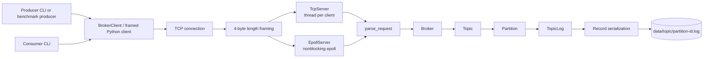
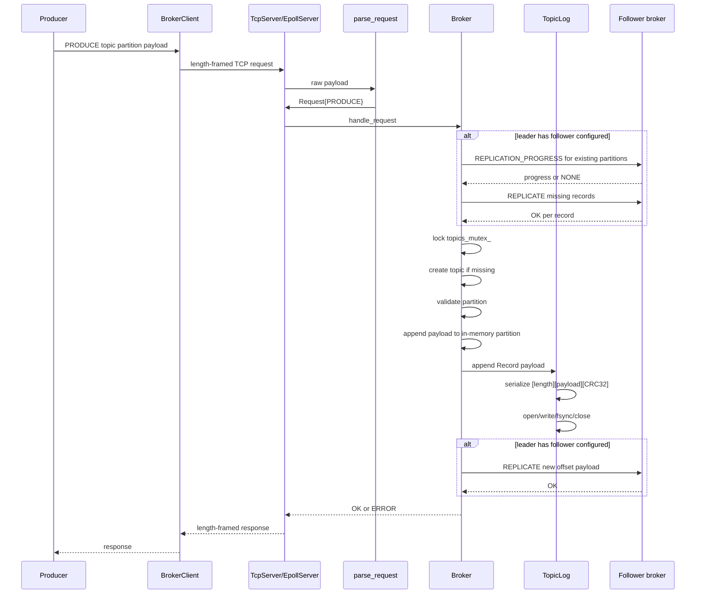
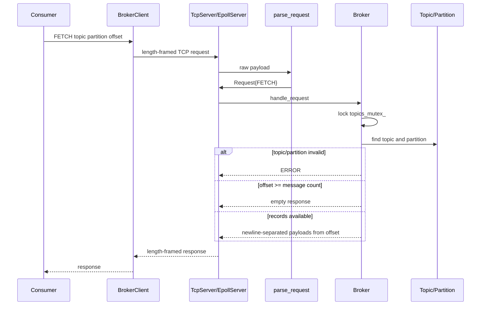
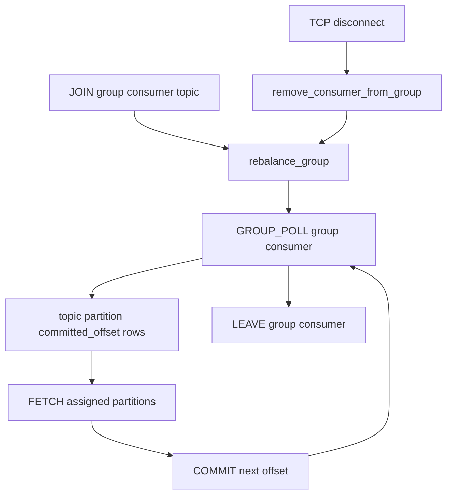
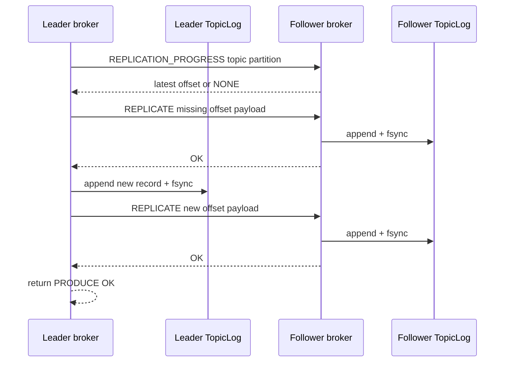
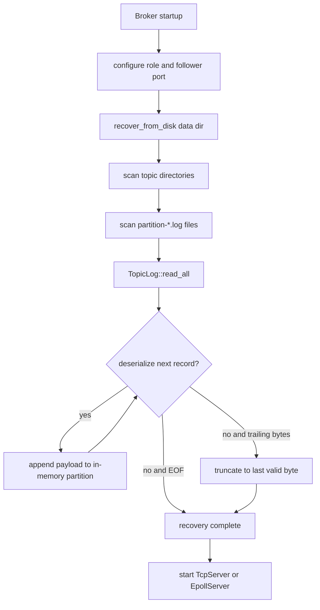
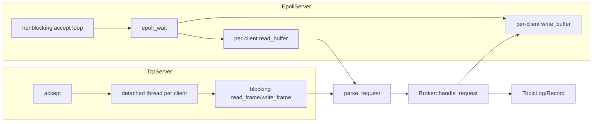

# Architecture

This document describes the current implementation, not an idealized design. The broker is a Kafka-inspired C++ project with a custom text protocol over length-prefixed TCP frames, persistent per-partition append-only logs, consumer groups, an optional epoll server path, simplified leader/follower replication, and in-memory metrics.

## Overall Architecture



Both server paths share `parse_request()`, `Broker::handle_request()`, `TopicLog`, and `Record`. The difference is networking: `TcpServer` blocks in a thread per client, while `EpollServer` uses nonblocking sockets and per-client buffers.

`main.cpp` supports:

```text
./build/kafka-broker [--epoll] <port> <data-directory> <leader|follower> [follower-port]
```

Without `--epoll`, the broker starts `TcpServer`. With `--epoll`, it starts `EpollServer`.

## Components

### Broker

Files: `src/broker.hpp`, `src/broker.cpp`

Responsibility:

- Own topics and partitions.
- Handle protocol requests.
- Persist produced records.
- Serve fetch responses.
- Manage consumer groups and committed offsets.
- Track replication role and follower progress.
- Record metrics.
- Recover topic/partition logs from disk.

Important state:

- `topics_`: topic name to `Topic`.
- `consumer_groups_`: group id to `ConsumerGroup`.
- `replication_progress_`: `TopicPartition` to latest replicated offset.
- `topics_mutex_`: protects topics and replication-progress operations.
- `consumer_groups_mutex_`: protects consumer-group state.
- `metrics_`: request counters and latency samples.
- `role_`: leader or follower.
- `follower_port_`: configured follower for leader replication.
- `data_dir_`: broker data directory.

Important interfaces:

- `configure()`
- `recover_from_disk()`
- `handle_request()`
- `remove_consumer_from_group()`
- `get_committed_offset()`
- `get_replication_progress()`
- `get_missing_records()`
- `catch_up_follower()`
- `promote_to_leader()`
- `get_metrics_snapshot()`

Does not handle:

- Raw socket accept/read/write.
- Kafka-compatible binary protocol.
- Background replication retry.
- Automatic leader election.
- Persistent consumer offsets.

### BrokerClient

File: `src/client.hpp`

Responsibility:

- Own one TCP socket.
- Connect to a host and port.
- Send one framed request and read one framed response.
- Provide RAII socket cleanup and move-only ownership.

Used by:

- `clients/producer.cpp`
- `clients/consumer.cpp`
- leader-to-follower replication code in `Broker`

Does not handle:

- Retries.
- Reconnect.
- Batching.
- Async I/O.
- Storage.

### Protocol

Files: `src/protocol.hpp`, `src/protocol.cpp`

Responsibility:

- Convert raw text requests into typed `Request` values.
- Validate command-specific fields.
- Preserve produce and replicate payload text after required fields.

Current commands:

```text
PING
METRICS
PRODUCE <topic> <partition> <payload>
FETCH <topic> <partition> <offset>
JOIN <group> <consumer_id> <topic>
LEAVE <group> <consumer_id>
GROUP_POLL <group> <consumer_id>
COMMIT <group> <consumer_id> <topic> <partition> <offset>
REPLICATE <topic> <partition> <offset> <payload>
REPLICATION_PROGRESS <topic> <partition>
```

Does not handle:

- TCP framing.
- Authentication.
- Escaping or binary payloads.
- Kafka's wire protocol.

### Framing

File: `src/framing.hpp`

Responsibility:

- Frame request and response payloads over TCP.
- Handle partial blocking reads/writes.
- Enforce 64 KiB maximum payload.

Wire format:

```text
[4-byte big-endian uint32 payload length][payload bytes]
```

Does not handle:

- Command parsing.
- Broker state.
- Disk persistence.

### TcpServer

Files: `src/tcp_server.hpp`, `src/tcp_server.cpp`

Responsibility:

- Create the listening socket.
- Bind, listen, and accept.
- Spawn one detached thread per client.
- Read framed requests with blocking helpers.
- Parse and delegate to `Broker`.
- Write framed responses.
- Track group memberships owned by the connection for disconnect cleanup.

Does not handle:

- Nonblocking sockets.
- epoll.
- Broker business logic.

### EpollServer

Files: `src/epoll_server.hpp`, `src/epoll_server.cpp`

Responsibility:

- Provide an event-driven networking path.
- Use nonblocking sockets.
- Use level-triggered epoll.
- Track per-client read and write buffers.
- Reconstruct frames incrementally.
- Queue framed responses and flush them with `EPOLLOUT`.
- Mirror `TcpServer` disconnect cleanup for consumer groups.

Does not handle:

- Separate broker semantics.
- Edge-triggered epoll.
- Multi-threaded event loops.
- Kernel bypass or advanced network tuning.

### TopicLog

File: `src/topic_log.hpp`

Responsibility:

- Persist records for one topic partition.
- Append serialized records to `data/<topic>/partition-<id>.log`.
- Use POSIX append/write/fsync/close.
- Read all valid records during recovery.
- Truncate invalid trailing bytes.

Does not handle:

- Protocol.
- Consumer offsets.
- Replication metadata files.
- Segment rolling or retention.

### Record

File: `src/record.hpp`

Responsibility:

- Represent a payload.
- Serialize and deserialize the persistent record format.
- Compute and validate CRC32.

Persistent format:

```text
[4-byte big-endian payload length][payload bytes][4-byte big-endian CRC32]
```

### Consumer-Group State

Files: `src/broker.hpp`, `src/broker.cpp`

Responsibility:

- Track members by group id and consumer id.
- Store topic subscription per member.
- Store assigned partitions per member.
- Store committed offsets by group and topic partition.

Key types:

- `ConsumerGroup`
- `GroupMember`
- `TopicPartition`

Does not handle:

- Persistent committed offsets.
- Heartbeats.
- Session timeouts.
- Offset replication.

### Replication State

Files: `src/broker.hpp`, `src/broker.cpp`

Responsibility:

- Track leader/follower role.
- Send internal `REPLICATE` requests from leader to follower.
- Answer `REPLICATION_PROGRESS` on followers.
- Recover follower progress from log length.
- Catch up missing records on the next leader produce.
- Support explicit in-process promotion.

Does not handle:

- Quorum.
- Consensus.
- Automatic failover.
- Runtime promotion command.
- Background retries.
- Enforcement of replicated offset continuity on the follower.

### Metrics

Files: `src/metrics.hpp`, `src/metrics.cpp`

Responsibility:

- Count requests and outcomes.
- Count selected request types.
- Track estimated bytes processed.
- Store latency samples.
- Produce CSV snapshots.

Latency is server-side broker handling latency, measured inside `Broker::handle_request()`. It excludes broker startup and excludes the client socket round trip.

### Benchmark Tooling

Files:

- `benchmarks/benchmark_driver.py`
- `benchmarks/run_tcp_vs_epoll.py`
- `benchmarks/analyze_tcp_vs_epoll.py`
- `benchmarks/plot_benchmarks.py`

Responsibility:

- Generate producer workloads.
- Collect broker metrics after the workload.
- Run the TCP-vs-epoll matrix.
- Aggregate raw results into summary CSV and graphs.

## Request Lifecycle: PRODUCE



Important current behavior:

- The public parser only accepts partitions `0..2`.
- `PRODUCE` auto-creates a topic.
- The leader appends to memory before `TopicLog::append()`.
- When a follower is configured, the leader attempts pre-produce catch-up with `synchronize_follower()`, but the current `handle_request()` code does not check that return value before proceeding to the new local append.
- With a follower configured, failure to replicate the new record returns `ERROR`; the current code does not roll back the local append.
- `TopicLog::append()` fsyncs before returning.

## Request Lifecycle: FETCH



`FETCH` reads from in-memory recovered state, not directly from disk on every request.

## Request Lifecycle: Consumer Group



Assignment algorithm:

1. Clear all member assignments.
2. Group members by subscribed topic.
3. Sort consumer IDs for deterministic output.
4. Assign partitions `0`, `1`, and `2` round-robin across sorted members.

## Request Lifecycle: Replication



## Recovery Flow



## TCP Vs Epoll Architecture



## Concurrency Model

### TcpServer

- Blocking sockets.
- One detached thread per accepted client.
- Each thread owns its client socket and local membership list.
- Threads share one `Broker`.
- Broker mutexes protect shared state.

### EpollServer

- One event loop.
- Nonblocking listening and client sockets.
- Level-triggered epoll.
- Per-client read buffers for partial frames.
- Per-client write buffers and offsets for partial response writes.
- `EPOLLIN` handles available reads.
- `EPOLLOUT` handles pending writes.

### Broker Synchronization

- `topics_mutex_` protects `topics_` and topic/partition message vectors.
- `consumer_groups_mutex_` protects `consumer_groups_`.
- `COMMIT` acquires `consumer_groups_mutex_` and then `topics_mutex_`.
- `PRODUCE` holds `topics_mutex_` while appending in memory and while `TopicLog::append()` performs disk I/O and `fsync`.
- `FETCH` holds `topics_mutex_` while building the response.

This is correct but coarse-grained. The implementation is not lock-free and does not provide high-concurrency partition-level isolation.

## Design Tradeoffs

| Tradeoff | What Was Chosen | Benefit | Cost / Limitation |
| --- | --- | --- | --- |
| Protocol | Custom text commands over binary length framing | Easy to test and debug | Not Kafka-compatible; limited payload escaping |
| Networking baseline | Thread per client | Simple lifecycle and correctness | One thread per connection; coarse scalability |
| Alternative networking | Level-triggered epoll | Handles many sockets in one loop | More buffering complexity; still shares broker locks |
| Durability | Synchronous append and `fsync` | Clear persistence point before success | Higher latency; disk I/O under `topics_mutex_` |
| Storage | Append-only partition files | Simple recovery and ordered offsets | No retention, segmenting, compaction, or indexes |
| Record integrity | CRC32 per record | Detects trailing corruption | Stops at first invalid record; no repair past corruption |
| Partitioning | Fixed 3 partitions; explicit partition in protocol | Simple routing and tests | No key hashing or dynamic partition count |
| Consumer offsets | In-memory group offsets | Easy to reason about during a process lifetime | Lost on broker restart |
| Assignment | Sorted consumer IDs, round-robin partitions | Deterministic behavior | No sticky/cooperative balancing or load awareness |
| Replication | Synchronous leader/follower ACK | Simple success semantics when follower is reachable | No quorum, retry loop, or rollback of local append on follower failure |
| Failover | Manual in-process promotion | Easy educational model | No automatic election or client redirection |
| Metrics | In-memory counters and latency vector | Lightweight and easy to export | Latency sample vector grows; metrics lost on restart |

Where motivation is not explicitly recorded, the benefits and costs above are engineering inferences from the implementation.

## Implemented, Simplified, And Possible Extensions

### Implemented

- Framed TCP request/response.
- Blocking `TcpServer`.
- Nonblocking `EpollServer`.
- Text protocol parser.
- Persistent per-partition logs.
- Startup log recovery.
- CRC validation and truncation of invalid trailing bytes.
- Fixed three-partition topics.
- Producer and consumer clients.
- Consumer groups with in-memory committed offsets.
- Coarse-grained thread safety.
- Simplified synchronous leader/follower replication.
- Explicit promotion API.
- Metrics and TCP-vs-epoll benchmark artifacts.

### Simplified / Intentionally Omitted

- Kafka wire compatibility.
- Persistent consumer offsets.
- Authentication or authorization.
- Dynamic partition creation.
- Retention and compaction.
- Segment indexes.
- Batching and compression.
- Idempotent producers and transactions.
- Exactly-once semantics.
- Automatic leader election.
- Quorum replication.
- Raft/KRaft.
- Heartbeats and failure detection.
- Background replication retry.
- Distributed metadata.

### Possible Production Extensions

- Persist consumer-group offsets.
- Add configurable durability modes.
- Move to per-topic or per-partition locking.
- Add batching and group commit.
- Add log segments, retention, and indexes.
- Add key-based partition routing.
- Add background replication and retry.
- Add leader election and quorum replication.
- Benchmark multi-node replication and consumer lag.
- Add CI, sanitizer targets, and long-running stress tests.
