# Interview Guide

This guide explains how to present and defend the Kafka-inspired C++ broker in backend, systems, networking, C++, and system-design interviews.

Use this as the interview layer. For implementation details, cross-check:

- `docs/stage_history.md`
- `docs/architecture.md`
- `docs/storage_recovery_semantics.md`
- `docs/stage11_observability.md`
- `current_architecture.md`

The project is Kafka-inspired, not Kafka-compatible. It deliberately implements a scoped broker with TCP framing, a text protocol, persistent partition logs, consumer groups, recovery, simplified replication, metrics, and local benchmarking.

## Project Pitch

### 30-Second Explanation

I built a Kafka-inspired message broker in C++ that accepts producer and consumer requests over TCP, stores messages in persistent append-only partition logs, supports consumer groups with committed offsets, recovers logs after restart, includes a nonblocking `epoll` server path beside a thread-per-client TCP server, implements simplified leader/follower replication, and exposes metrics used in a TCP-vs-epoll benchmark.

### 1-Minute Explanation

The broker lets producers send `PRODUCE` requests and consumers send `FETCH` requests over a custom length-prefixed TCP protocol. Topics have three fixed partitions, and offsets are zero-based positions within each partition. Records are persisted to disk in append-only log files using a binary format with payload length, payload bytes, and CRC32. On restart, the broker scans the logs, validates records, truncates incomplete or corrupt trailing bytes, and rebuilds in-memory state.

I added consumer groups with `JOIN`, `GROUP_POLL`, `COMMIT`, and `LEAVE`, using deterministic round-robin assignment across partitions and in-memory committed offsets. The networking layer has both a blocking `TcpServer` that uses one thread per client and an `EpollServer` that uses nonblocking sockets, per-client buffers, `EPOLLIN`, and `EPOLLOUT`. Replication is a simplified synchronous leader/follower model using internal `REPLICATE` and `REPLICATION_PROGRESS` commands. Stage 11 added in-memory request metrics and a controlled benchmark comparing TCP and epoll under producer concurrency.

### 3-5 Minute Explanation

I built the project in stages so each major system concern is isolated. First I implemented a Linux TCP server with 4-byte big-endian length-prefix framing, because TCP is a byte stream and cannot preserve application message boundaries. Above that, I added a text protocol parser that turns commands like `PRODUCE <topic> <partition> <payload>` and `FETCH <topic> <partition> <offset>` into typed requests.

The core domain object is `Broker`. It owns topics, partitions, consumer groups, replication progress, and metrics. A topic has three fixed partitions. Each partition has an in-memory vector of payloads and a persistent `TopicLog` file at `data/<topic>/partition-<id>.log`. On produce, the broker validates the request, appends the payload to the partition, serializes the record as `[length][payload][CRC32]`, writes it with POSIX `write()`, and calls `fsync()` before returning success. On fetch, it reads from recovered in-memory state and returns newline-separated records starting from the requested offset.

Consumer groups let multiple consumers share partition work. A consumer joins a group for a topic, the broker deterministically assigns partitions by sorting consumer IDs and round-robin assigning partitions 0, 1, and 2, and the consumer fetches from the group committed offset. `COMMIT` stores the next offset in memory under group/topic/partition. That gives at-least-once-style behavior: if a consumer fetches records and crashes before committing, those records can be delivered again.

For concurrency, the first server path is `TcpServer`, which accepts connections and creates one detached thread per client. Shared broker state is protected by `topics_mutex_` and `consumer_groups_mutex_`. Later I added `EpollServer`, which keeps the same broker/protocol/storage path but changes networking to nonblocking sockets and an epoll event loop with per-client read and write buffers. That let me compare two networking models without duplicating broker logic.

For failure recovery, startup scans topic/partition logs, validates record CRCs, stops at the first invalid or incomplete record, and truncates the file back to the last valid boundary. For replication, a leader can synchronously send records to a follower over the same framed TCP request/response path using internal `REPLICATE` commands. Follower progress is recovered from its persisted logs, and catch-up is triggered by the next leader produce. There is manual promotion through `Broker::promote_to_leader()`, but no automatic leader election or consensus protocol.

Finally, Stage 11 added metrics: request counts, success/failure counts, selected command counts, estimated bytes processed, and latency percentiles. The benchmark compared `TcpServer` vs `EpollServer` with 1, 2, 4, 8, and 16 producers, 1000 messages per producer, 1024-byte payloads, and three repetitions per configuration. The results show measured tradeoffs in that local experiment, not a universal performance winner.

## System-Design Interview Flow

If an interviewer says, "Design your Kafka-like message broker," start broad and refine.

### Step 1: Requirements

Implemented functional requirements:

- Producers can send `PRODUCE`.
- Consumers can send `FETCH`.
- Topics have partitions.
- Offsets identify records within a partition.
- Consumer groups can `JOIN`, `GROUP_POLL`, `COMMIT`, and `LEAVE`.
- Produced records are persisted.
- Broker restart recovers topic/partition logs.
- Invalid trailing records are detected and truncated.
- A simplified leader can replicate records to a follower.
- Metrics expose request counts, bytes, and latency percentiles.
- TCP and epoll server paths are both available.

Current non-functional goals:

- Clear separation of networking, framing, protocol, broker logic, storage, and metrics.
- Correctness under concurrent requests using mutexes.
- Honest local benchmark measurements.

Not implemented, but reasonable production extensions:

- Kafka wire compatibility.
- Dynamic partition counts.
- Persistent consumer offsets.
- Automatic leader election.
- Quorum consensus or Raft.
- Automatic failover.
- Distributed metadata.
- Background replication retry.
- Retention, compaction, segment indexes.
- Authentication, authorization, and multi-tenant isolation.

### Step 2: High-Level Architecture

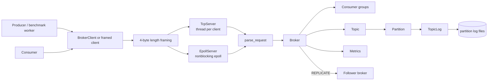

Explain it as layered ownership: server receives bytes, framing reconstructs requests, protocol parses commands, broker owns state and decisions, storage persists partition logs.

### Step 3: Data Model

Topic:

- Named stream.
- Auto-created on first valid `PRODUCE`.
- Has three fixed partitions.

Partition:

- Ordered append unit.
- Stores in-memory `std::vector<std::string>` messages.
- Persists to `data/<topic>/partition-<id>.log`.

Record:

- Payload string in memory.
- Serialized on disk as `[4-byte length][payload][4-byte CRC32]`.

Offset:

- Zero-based index in one partition.
- Not a global topic offset.

Consumer group:

- Group id with member map.
- Members have `consumer_id`, subscribed topic, and assignments.
- Committed offsets are in memory by group/topic/partition.

Consumer:

- Joins a group.
- Polls assignments.
- Fetches assigned partitions.
- Commits next offsets.

Leader/follower:

- Leader handles produce.
- Follower accepts internal replication.
- Follower progress is tracked by topic partition.

### Step 4: Request Flow

PRODUCE:

1. Producer builds text command.
2. Client sends it as a length-framed TCP payload.
3. Server reconstructs the frame.
4. Parser returns `RequestType::PRODUCE`.
5. Broker locks topic state.
6. Topic is found or created.
7. Partition is validated.
8. Payload is appended in memory.
9. `TopicLog::append()` serializes and fsyncs.
10. If configured, leader sends `REPLICATE` to follower.
11. Broker returns `OK` or `ERROR`.

FETCH:

1. Consumer sends `FETCH <topic> <partition> <offset>`.
2. Server reconstructs and parses it.
3. Broker locks topic state.
4. Broker finds topic and partition.
5. Broker returns newline-separated messages from the offset, empty response at end, or `ERROR`.

### Step 5: Persistence

The storage design is append-only because it maps naturally to ordered partition logs. Each record is length-prefixed so recovery can know payload boundaries, and CRC-protected so recovery can detect corruption. `fsync()` is used to force the file descriptor's dirty data to disk before acknowledging success from `TopicLog::append()`.

### Step 6: Concurrency

`TcpServer`:

- Blocking sockets.
- One detached thread per client.
- Shared `Broker` protected by mutexes.

`EpollServer`:

- Nonblocking sockets.
- One event loop.
- Per-client read and write buffers.
- `EPOLLIN` for read readiness.
- `EPOLLOUT` for pending writes.

Broker synchronization:

- `topics_mutex_` protects topic/partition/message state.
- `consumer_groups_mutex_` protects group state.
- `COMMIT` uses group lock, then topic lock.
- Current locking is correct but coarse-grained.

### Step 7: Consumer Groups

Groups solve shared consumption: multiple consumers in one group split partitions so each partition is assigned to at most one group member for a subscribed topic.

Algorithm:

1. Group members are collected by subscribed topic.
2. Consumer IDs are sorted.
3. Partitions `0`, `1`, and `2` are round-robin assigned.
4. `GROUP_POLL` returns assignment rows with committed offsets.
5. `COMMIT` advances the group-owned offset.

### Step 8: Failure Recovery

On startup, the broker scans the data directory, reads each partition log, validates records in order, and truncates trailing invalid bytes. This recovers topic data but not consumer group committed offsets, because offsets are currently in memory only.

### Step 9: Replication

The project implements simplified synchronous leader/follower replication. A leader appends locally and sends internal `REPLICATE` commands to a follower. The follower appends and fsyncs before returning `OK`. Follower progress is recovered from the number of valid records in its logs. Promotion is explicit through `Broker::promote_to_leader()`; there is no automatic election or consensus.

### Step 10: Observability And Benchmarking

Metrics track total requests, successes, failures, selected request type counts, bytes, average latency, p50, p95, p99, and max latency. The benchmark compared TCP and epoll with producer counts 1, 2, 4, 8, and 16, 1000 messages per producer, 1024-byte payloads, and three repetitions. Startup was excluded from the workload timer, fresh data directories were used, and metrics were fetched outside the workload timer.

## Important Flow Diagrams

### 1. Overall System Architecture

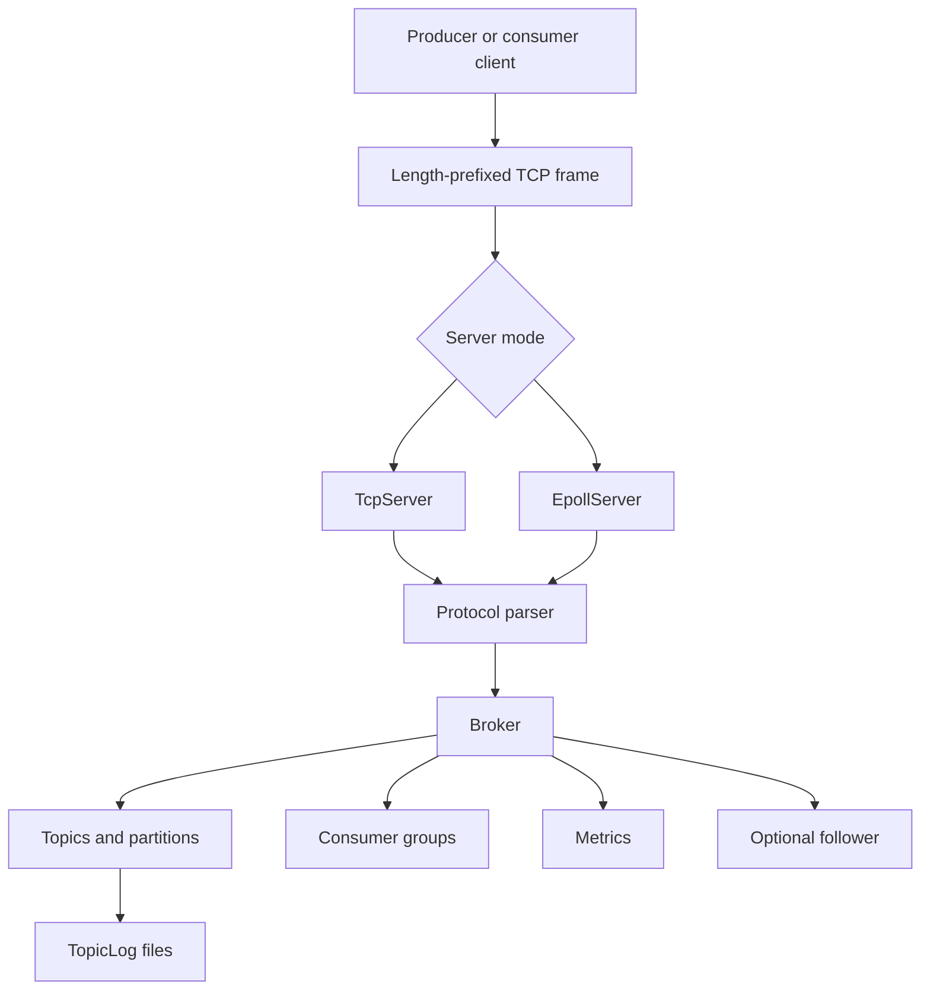

The interview point: the server mode is replaceable because both paths reuse the same parser, broker, and storage layers.

### 2. PRODUCE Request

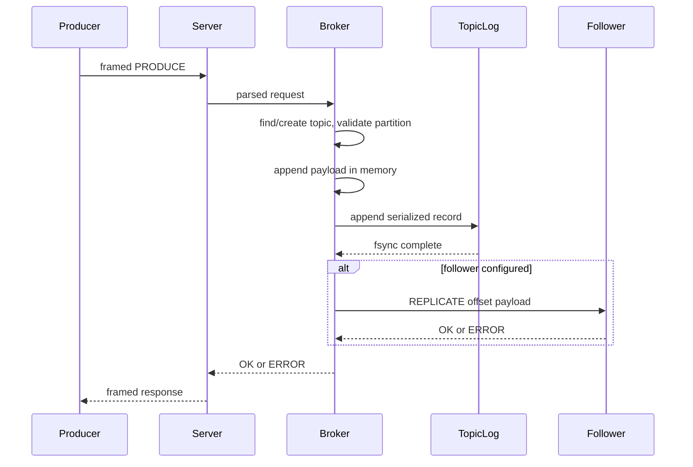

The interview point: success is tied to local persistence and, when configured, follower acknowledgement.

### 3. FETCH Request

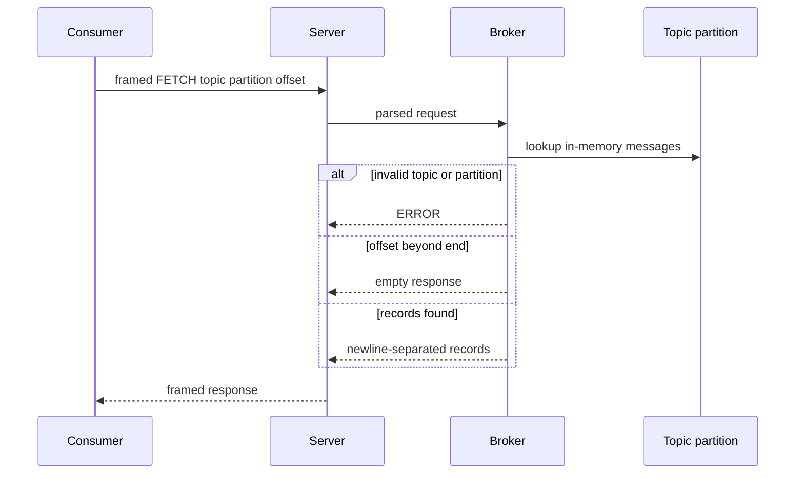

The interview point: fetch reads recovered in-memory state, while disk is used for append and restart recovery.

### 4. Consumer Group Lifecycle

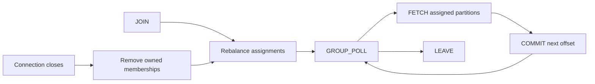

The interview point: `FETCH` and `COMMIT` are separate, so duplicate delivery is possible if a consumer crashes before commit.

### 5. Partition Assignment

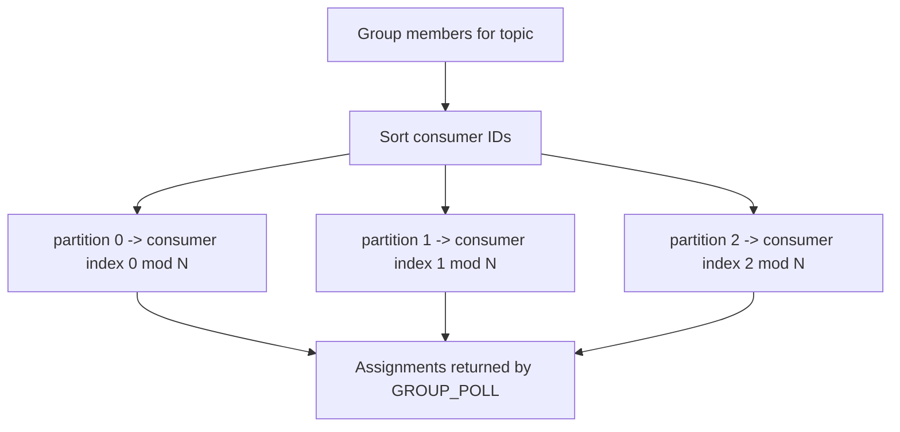

The interview point: deterministic round-robin is simple, predictable, and testable.

### 6. Persistent Record Write

```mermaid
flowchart LR
    Payload[payload] --> Length[4-byte big-endian length]
    Length --> Buffer[length + payload]
    Payload --> Buffer
    Buffer --> CRC[CRC32 over length + payload]
    CRC --> Record[[length][payload][CRC]]
    Record --> Write[POSIX write loop]
    Write --> Sync[fsync]
```

The interview point: length gives record boundaries; CRC detects corruption; fsync defines the local durability point.

### 7. Crash Recovery

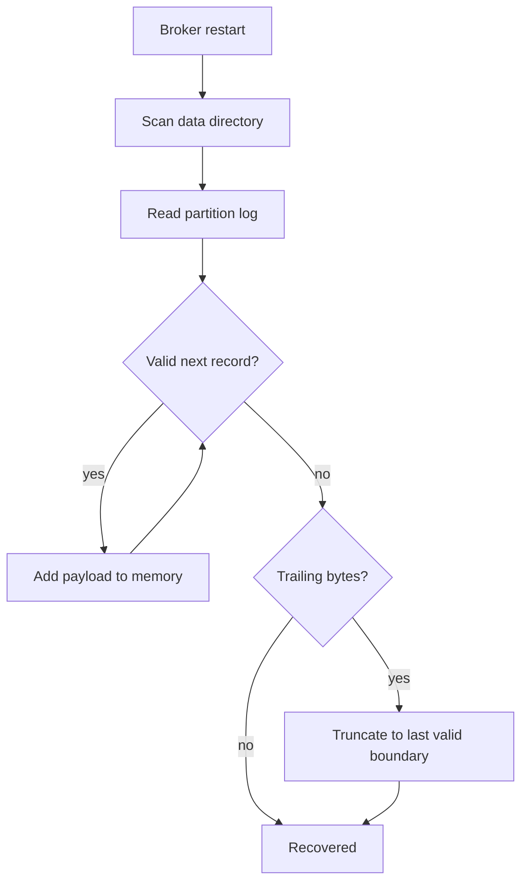

The interview point: recovery is conservative and stops at first invalid record.

### 8. Leader/Follower Replication

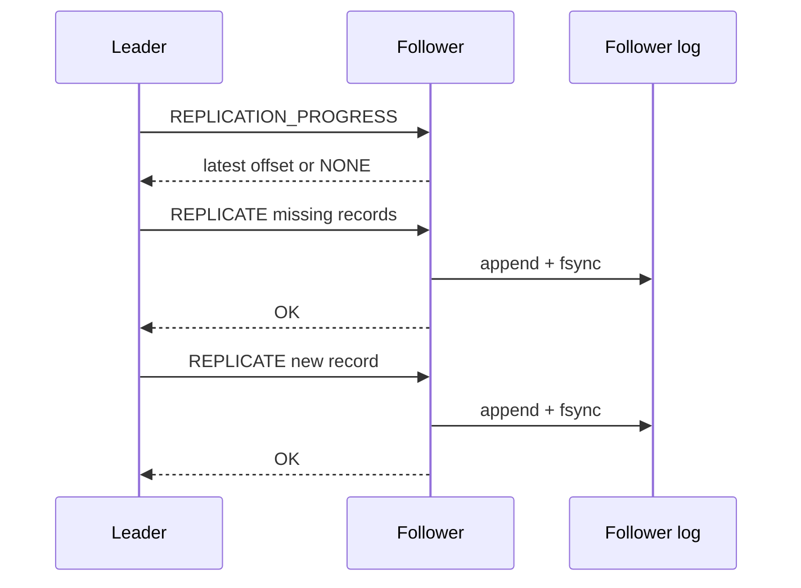

The interview point: this is synchronous replication, not quorum consensus.

### 9. Leader Promotion

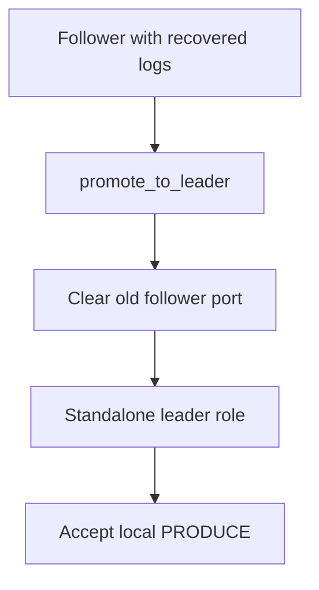

The interview point: promotion is explicit/manual and does not include automatic failure detection.

### 10. TcpServer Request Processing

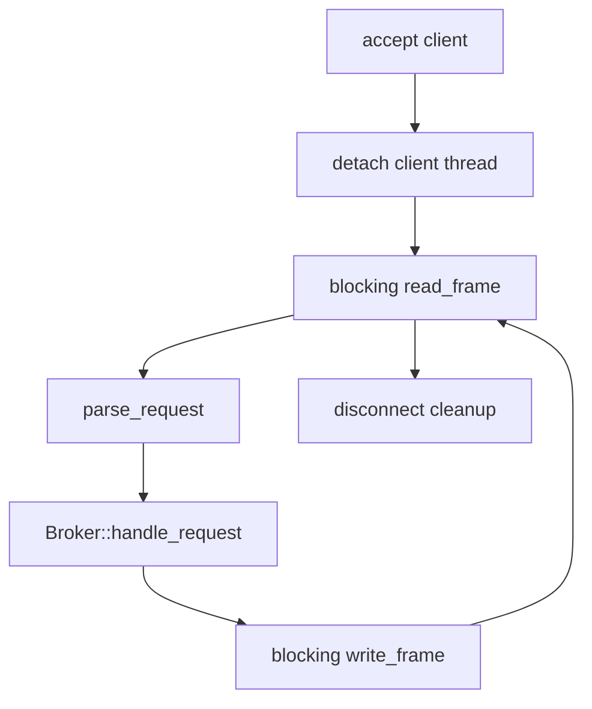

The interview point: simple blocking flow, easy to reason about, with broker locks protecting shared state.

### 11. EpollServer Event Loop

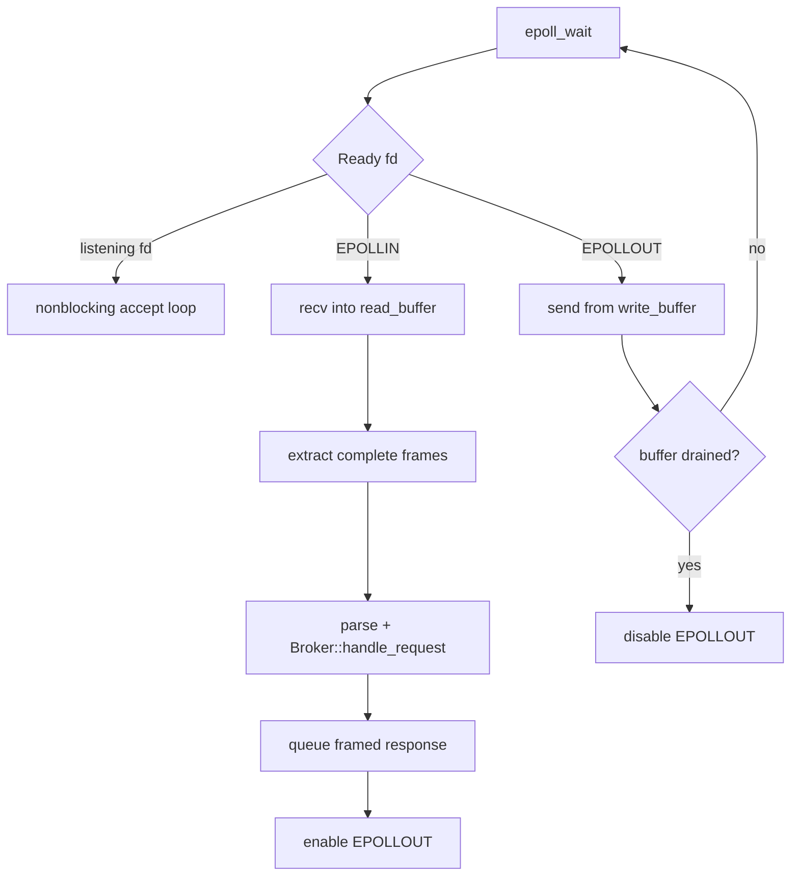

The interview point: epoll solves readiness management, but application framing still requires explicit buffers.

## Deep-Dive Interview Questions

### Networking

**Why TCP?**

TCP gives reliable, ordered byte delivery, which is a reasonable base for broker request/response traffic. The project focuses on application framing, broker semantics, persistence, and concurrency rather than implementing reliability above UDP.

**Why length-prefixed framing?**

TCP is a byte stream and does not preserve request boundaries. A 4-byte big-endian length prefix lets the receiver know exactly how many payload bytes belong to the next request or response.

**Why not newline-delimited messages?**

Newline framing is easy, but it constrains payloads or requires escaping. Length-prefix framing works for arbitrary payload bytes at the framing layer. The current text protocol still has practical text payload limitations, but the frame layer itself is cleaner.

**What happens with partial TCP reads?**

`TcpServer` uses `read_exactly()` to loop until the requested number of bytes arrives. `EpollServer` stores partial bytes in each client's `read_buffer` and extracts frames only when enough bytes are present.

**What happens with partial writes?**

`TcpServer` uses `write_exactly()` to loop until all bytes are sent. `EpollServer` stores pending bytes in `write_buffer`, advances `write_offset`, and waits for future `EPOLLOUT` readiness if the socket cannot accept all bytes.

**What is network byte order?**

Network byte order is big-endian. The project uses `htonl()` and `ntohl()` for frame lengths and persistent record length/CRC fields so byte order is consistent.

**Why is framing necessary?**

Without framing, the server cannot distinguish one complete request from half a request, multiple coalesced requests, or arbitrary TCP packet boundaries.

**How does TcpServer handle clients?**

It accepts a connection, starts a detached thread for that client, repeatedly reads framed requests, parses them, calls `Broker::handle_request()`, writes framed responses, and removes owned group memberships when the connection closes.

**How does EpollServer handle clients?**

It registers nonblocking sockets with epoll, stores per-client state, appends incoming bytes to `read_buffer`, extracts complete frames, queues framed responses in `write_buffer`, and uses `EPOLLOUT` to flush pending bytes.

**What is nonblocking I/O?**

A nonblocking socket returns immediately if it cannot make progress, usually with `EAGAIN` or `EWOULDBLOCK`. The event loop then waits for readiness instead of blocking one thread per connection.

**What does epoll actually solve?**

It lets one event loop monitor many file descriptors for readiness. It does not parse messages, guarantee full reads/writes, remove the need for buffers, or make broker state automatically scalable.

**Why EPOLLIN?**

`EPOLLIN` tells the event loop a socket may be readable. The code then calls `recv()` until the socket would block.

**Why EPOLLOUT?**

`EPOLLOUT` is enabled only when a client has queued response bytes. It tells the event loop the socket may accept writes.

**How are client buffers maintained?**

Each epoll client has `read_buffer`, `write_buffer`, `write_offset`, and joined-group tracking. Incomplete reads and writes stay with that client.

**Why can't one recv() assume a complete request?**

Because TCP can split one request across many reads or coalesce multiple requests into one read. Application framing, not `recv()` boundaries, defines request boundaries.

### Protocol

**What commands exist?**

`PING`, `METRICS`, `PRODUCE`, `FETCH`, `JOIN`, `LEAVE`, `GROUP_POLL`, `COMMIT`, `REPLICATE`, and `REPLICATION_PROGRESS`.

**How is a request parsed?**

`parse_request()` tokenizes the text command, validates fields, parses partition/offset numbers, preserves payload text for produce/replicate, and returns a typed `Request`.

**How are malformed requests handled?**

They become `RequestType::INVALID`, and `Broker::handle_request()` returns `ERROR`.

**Why separate parsing from broker logic?**

It keeps wire syntax separate from domain behavior. Networking produces bytes, framing produces payloads, parsing produces typed requests, and the broker executes them.

**How does framing differ from protocol parsing?**

Framing answers "where does this payload begin and end?" Protocol parsing answers "what command is inside this payload?"

### Storage

**Why append-only logs?**

Append-only logs preserve order, make offsets simple, and make recovery straightforward. This mirrors the core idea of Kafka partition logs.

**Why partitions?**

Partitions isolate ordering and create units that can be assigned to consumers and replicated independently. In this project, there are three fixed partitions.

**How are offsets represented?**

Offsets are zero-based indexes in a partition's in-memory message vector. They are not byte offsets and not global topic offsets.

**What does fsync provide?**

In this implementation, successful `fsync()` means the broker asked the OS to flush the log file's dirty data to storage before acknowledging. It is not a full distributed durability guarantee.

**Why use POSIX write/fsync?**

It makes the durability path explicit: open, write all bytes, fsync, close. That is useful for learning and for discussing failure boundaries.

**What happens if the process crashes during a write?**

The log may contain a partial final record. On restart, recovery accepts valid records up to the invalid trailing region and truncates the file back to the last valid boundary.

**Why CRC32?**

CRC32 detects corrupt records. Length alone can detect incomplete records, but CRC catches payload corruption where the length still appears valid.

**What happens when a record is corrupt?**

Deserialization fails. Recovery stops at that record and truncates the trailing invalid region.

**Why truncate an incomplete final record?**

It restores the log to a valid prefix so future appends start at a clean boundary.

**What happens after restart?**

Topic and partition messages are recovered from logs. Consumer-group committed offsets are not recovered because they are in memory only.

### Concurrency

**What happens with multiple producers?**

Concurrent producer requests enter the shared `Broker`. `topics_mutex_` serializes access to topic/partition state and storage append sections.

**What state is shared?**

Topics, partitions, message vectors, consumer groups, committed offsets, replication progress, and metrics are shared.

**What locks are used?**

`topics_mutex_` protects topic/partition state. `consumer_groups_mutex_` protects consumer-group state. Metrics use atomics and a latency-sample mutex.

**Where are critical sections?**

`PRODUCE` holds `topics_mutex_` through in-memory append and `TopicLog::append()`. `FETCH` holds it while building responses. `COMMIT` holds group state and briefly validates topic/partition under `topics_mutex_`.

**Why use coarse-grained locking?**

Engineering reasoning: it is simpler and easier to validate for a learning project. It reduced risk while building persistence, groups, recovery, and replication.

**What are the limitations?**

Different partitions still contend on one topic mutex. Disk I/O and `fsync()` happen while holding that lock. This limits scalability.

**What would you change for higher scalability?**

Consider per-topic or per-partition locks, batching, append queues, async disk I/O, log segment indexes, and separating storage workers from request threads.

### Consumer Groups

**What is a consumer group?**

A set of consumers that share partition consumption for a topic.

**Why do consumer groups exist?**

They let consumers scale reads while keeping each partition assigned to at most one consumer in the group.

**How are partitions assigned?**

The broker sorts consumer IDs for a topic and round-robin assigns partitions 0, 1, and 2.

**Why deterministic assignment?**

It makes behavior predictable, easy to test, and easy to explain. It is not a production-grade balancing strategy.

**What happens when consumers join?**

The member is added if its `consumer_id` is not already present in the group, then assignments are recalculated.

**What happens when a consumer leaves?**

The member is removed. Empty groups are deleted; non-empty groups are rebalanced.

**What does COMMIT do?**

It stores the next offset under group/topic/partition in memory.

**What happens if a consumer crashes before commit?**

The group offset does not advance, so another consumer may fetch the same records again.

**What delivery semantics result?**

At-least-once-style consumer behavior. Duplicates are possible; exactly-once is not implemented.

### Replication

**Why replication?**

Replication creates another durable copy of partition data and introduces the core distributed-systems concerns around progress, catch-up, and failover.

**How does leader/follower replication work?**

The leader sends internal framed TCP commands to the follower. The follower appends and fsyncs records, updates progress, and returns `OK`.

**When does the leader append?**

For a new produce, the leader appends locally before sending the new `REPLICATE` command.

**When does fsync happen?**

Local leader append calls `fsync()` through `TopicLog::append()`. Follower append also calls `fsync()` before `OK`.

**When does the follower append?**

On `REPLICATE <topic> <partition> <offset> <payload>`, if the broker is in follower role and the partition is valid.

**What does the ACK mean?**

Follower `OK` means the follower accepted the replication request and completed its append path. It is not a quorum acknowledgment.

**How does follower catch-up work?**

The leader asks for `REPLICATION_PROGRESS`, computes local records after that offset, and sends them in order as `REPLICATE` requests.

**How is replication progress recovered?**

A follower derives progress from recovered record count: latest progress is `records.size() - 1` for non-empty partitions.

**What happens during leader promotion?**

`promote_to_leader()` sets the role to leader and clears the old follower port. Existing recovered data remains available.

**Why is there no automatic election?**

Automatic election requires failure detection, cluster membership, quorum, and split-brain prevention. Those are intentionally out of scope.

**Why isn't this Raft?**

Raft requires terms, voting, replicated log matching, commit indexes, majorities, and leader election. This project implements a simpler single leader/follower replication path.

**What would be required for production-grade consensus?**

Cluster membership, durable metadata, leader election, quorum writes, log consistency checks, heartbeats, failure detectors, membership changes, and client routing.

### Recovery

**What failures can the current implementation recover from?**

Broker restart with valid logs, incomplete trailing records, and CRC-corrupt trailing records.

**What happens after broker restart?**

Topic/partition records are recovered. In-memory consumer offsets and metrics are reset.

**What happens to an incomplete final record?**

It is rejected during deserialization, and the log is truncated to the last valid boundary.

**How does CRC validation help?**

It prevents accepting a corrupted payload as valid just because its length field is parseable.

**What failures are NOT handled automatically?**

Automatic leader election, automatic failover, background replication retry, persistent committed offsets, and distributed metadata recovery.

### Performance

**What did Stage 11 measure?**

A local TCP-vs-epoll producer workload across 1, 2, 4, 8, and 16 producers, with 1000 messages per producer, 1024-byte payloads, and three repetitions.

**Why measure throughput?**

Throughput shows how many messages per second the broker handles under a workload.

**Why p50?**

p50 shows the median request latency, which represents the typical request.

**Why p95?**

p95 shows tail behavior for slower requests without being dominated by the single worst outlier.

**Why p99?**

p99 shows more extreme tail latency and helps spot occasional stalls.

**Why not only average latency?**

Averages can hide tail latency. A few slow requests may matter even when the average looks fine.

**Why run three repetitions?**

Repetitions show variability and reduce the chance of overreacting to one noisy run.

**Why use fresh data directories?**

Fresh directories make runs more comparable by avoiding leftovers from earlier runs.

**Why exclude startup from the timer?**

The experiment measures workload processing, not broker startup or recovery.

**Why compare TCP and epoll?**

They represent two networking models over the same broker logic: thread-per-client blocking I/O versus event-driven nonblocking I/O.

**What did the benchmark actually show?**

In the existing summary, epoll had higher mean throughput at 1 and 2 producers, while TCP had higher mean throughput at 4, 8, and 16 producers. Epoll had lower mean p50 latency at all measured producer counts. For p95 and p99, TCP was lower at 1 producer and epoll was lower at 2, 4, 8, and 16.

**Why can't we claim Epoll is universally faster?**

The dataset is one local workload, one topic, one partition, producer-only, three repetitions, and the broker still has shared internal locks. It supports observations for that experiment, not universal performance claims.

**Why can throughput and latency move differently?**

Throughput aggregates completed work over time, while latency measures individual request processing time. Concurrency, lock contention, scheduling, and disk fsync can affect them differently.

**What are the benchmark limitations?**

It is local, single-node, producer-only, one topic, one partition, fixed payload size, limited repetitions, no multi-node replication workload, and no consumer-lag benchmark.

## "Why Did You..." Design Challenges

| Challenge | Current Project | Why Reasonable Here | Tradeoff | Production Alternative |
| --- | --- | --- | --- | --- |
| Why C++? | Broker is implemented in C++17. | Gives direct exposure to sockets, file descriptors, memory ownership, and POSIX APIs. | More manual error handling than higher-level runtimes. | C++, Java, Go, or Rust depending on team/runtime goals. |
| Why TCP? | Uses TCP request/response. | Reliable ordered byte stream fits broker commands. | Need explicit framing; head-of-line effects. | Still often TCP; possibly HTTP/2, QUIC, or custom transports. |
| Why custom protocol? | Text commands over framed TCP. | Easy to debug and evolve for learning. | Not Kafka-compatible; limited payload escaping. | Kafka protocol, protobuf, flatbuffers, or versioned binary protocol. |
| Why length-prefix framing? | 4-byte big-endian length. | Clear request boundaries over TCP. | Requires buffering and max-frame policy. | Varint lengths, framed binary protocol, HTTP/2 frames. |
| Why append-only storage? | One log per topic partition. | Simple ordering, offsets, and recovery. | No compaction, retention, or indexing. | Segmented logs with indexes, retention, compaction. |
| Why fsync? | Append path calls `fsync()`. | Explicit local durability point. | Higher latency, especially under coarse lock. | Batched fsync, group commit, configurable durability. |
| Why CRC? | CRC32 per record. | Detects corrupt trailing records. | Adds bytes and CPU; not cryptographic. | Stronger checksums, page-level checks, segment validation. |
| Why partitions? | Three fixed partitions. | Enables partition-local ordering and group assignment. | No dynamic scaling or key routing. | Dynamic partitions, key hashing, partition reassignment. |
| Why consumer groups? | Group membership, assignment, commits. | Demonstrates shared consumption and at-least-once behavior. | In-memory offsets; simple rebalance. | Persistent offsets, heartbeats, cooperative rebalancing. |
| Why coarse-grained locking? | Global topic mutex plus group mutex. | Correct and understandable for staged learning. | Partition contention and disk I/O under lock. | Per-partition locks, append queues, lock-free read indexes. |
| Why thread-per-client? | `TcpServer` baseline. | Simple lifecycle and debugging. | Thread overhead at high connection counts. | Event loops, thread pools, async runtimes. |
| Why epoll? | Alternative server path. | Shows scalable readiness-based I/O and partial I/O handling. | More state-machine complexity. | Multi-loop epoll, io_uring, async framework. |
| Why keep both TCP and Epoll implementations? | Both share broker logic. | Enables correctness baseline and controlled comparison. | More networking code to maintain. | One production network stack after evaluation. |
| Why synchronous replication? | Leader waits for follower `OK`. | Simple success semantics. | Higher latency; no quorum; no retry queue. | Quorum replication with ISR/consensus. |
| Why manual leader promotion? | `promote_to_leader()` only. | Demonstrates failover concept without consensus complexity. | No automatic recovery from leader failure. | Leader election with heartbeats and quorum. |
| Why no leader election? | Not implemented. | Election is a separate distributed-systems project. | Manual intervention required. | Raft/KRaft/ZooKeeper-style controller. |
| Why no Raft? | No terms/votes/quorum log matching. | Scope is Kafka-inspired broker mechanics, not consensus. | Cannot claim split-brain safety or quorum durability. | Implement Raft or integrate a consensus layer. |
| Why in-memory consumer offsets? | Group offsets are process memory. | Enough to demonstrate group semantics. | Offsets lost on broker restart. | Persist offsets in an internal compacted topic or metadata store. |

## Failure Scenarios

| Failure | What Happens | Current Guarantee | Not Guaranteed | Production Improvement |
| --- | --- | --- | --- | --- |
| Producer disconnects mid-request | Incomplete frame fails or connection closes. | Other clients continue. | Partial request completion. | Client retries with idempotent producer IDs. |
| Consumer disconnects | Server removes group memberships owned by that connection. | Group is rebalanced or removed if empty. | Persistent session timeout model. | Heartbeats and session timeout coordinator. |
| Broker crashes during append | Log may end with partial record. | Recovery truncates invalid trailing bytes. | Completion of the in-flight record unless append and `fsync()` finished before the crash. | WAL discipline, transactional append, segment checks. |
| Incomplete record | Deserialization fails at trailing region. | Valid prefix is kept. | Reconstruction of partial payload. | Segment-level recovery tools. |
| CRC failure | Recovery stops and truncates to last valid record. | Corrupt trailing record is not accepted. | Scanning past corruption. | Checksummed segments and repair workflows. |
| Follower unavailable | New replication attempt can return `ERROR`; pre-produce catch-up result is not checked. | Local code reports new replicate failure after local append. | Automatic retry, rollback, quorum durability. | Retry queue, ISR, quorum commit. |
| Follower behind | Leader can query progress and send missing records on next produce. | Ordered catch-up by payload list after progress. | Background catch-up. | Background replication manager. |
| Leader promotion | Explicit method changes follower to leader. | Recovered data remains available. | Automatic election or client redirection. | Consensus and metadata controller. |
| Consumer crashes before `COMMIT` | Group offset remains old. | Message can be fetched again. | Exactly-once delivery. | Transactions or idempotent processing. |
| Consumer crashes after `COMMIT` | Group offset has advanced. | Next consumer starts after committed offset. | Processing actually completed in downstream system. | Transactional offset + output commit. |
| Malformed request | Parser returns invalid; broker returns `ERROR`. | Broker does not execute malformed command. | Rich error codes. | Versioned protocol with structured errors. |
| Partial network read/write | TCP path loops; epoll path buffers. | Complete frames are reconstructed before parsing. | Infinite buffering; frames over 64 KiB. | Backpressure and configurable frame limits. |

## How Would You Scale This System?

### Current Project

Current scalability model:

- Single broker process owns topics and groups.
- Topics have fixed three partitions.
- `TcpServer` supports multiple clients with one thread per client.
- `EpollServer` supports multiple clients with one event loop.
- Broker topic state is protected by a coarse `topics_mutex_`.
- `PRODUCE` holds the topic lock through disk append and fsync.
- Replication is one configured follower, synchronous, and not quorum-based.

This is enough to demonstrate broker internals, but it is not a horizontally scalable distributed Kafka replacement.

### Production Extension

To scale horizontally:

- Distribute partitions across multiple broker nodes.
- Assign leaders for each partition, not one global leader.
- Add replication factor per partition.
- Maintain cluster metadata for topic/partition placement.
- Add automatic leader election for failed partition leaders.
- Use quorum consensus or an equivalent controller/metadata system.
- Route producers and consumers to partition leaders.
- Add load balancing and partition reassignment.
- Persist consumer offsets in a replicated internal store.
- Reduce lock contention with per-partition locks or append queues.
- Batch produce requests and fsyncs.
- Add asynchronous disk I/O or dedicated storage threads.
- Add network backpressure and memory limits.
- Benchmark multi-node produce, fetch, replication, and consumer lag.

The clean interview phrasing: "The current project demonstrates the mechanics inside one broker and a simplified follower. To make it production-distributed, I would shard by partition, replicate each partition with quorum semantics, and add a metadata/election layer."

## Tradeoff Table

| Decision | Benefit | Cost/Limitation | Production Alternative |
| --- | --- | --- | --- |
| C++17 | Direct systems programming and POSIX APIs | More manual resource/error handling | C++, Rust, Go, Java |
| TCP | Reliable ordered transport | Requires framing | TCP with mature protocol, QUIC |
| 4-byte length frames | Simple complete-message detection | Fixed max and buffering | Varint frames, multiplexed protocol |
| Text protocol | Easy debugging | Not Kafka-compatible | Versioned binary protocol |
| Fixed 3 partitions | Simple assignment and tests | No dynamic scale | Configurable partitions |
| Append-only files | Simple ordered persistence | No retention/indexes | Segmented indexed logs |
| `fsync()` on append | Clear durability point | Latency and lock contention | Group commit, async flush |
| CRC32 | Corruption detection | Not cryptographic | Stronger checksums |
| Thread-per-client baseline | Easy to reason about | Thread overhead | Event loop/thread pool |
| Epoll alternative | Readiness-based concurrency | Buffer/state complexity | Multi-reactor, io_uring |
| Coarse locks | Correct and simple | Limits parallelism | Per-partition synchronization |
| In-memory offsets | Simple group demo | Lost on restart | Replicated offset log |
| Synchronous follower ACK | Simple replication semantics | Higher latency, no quorum | ISR/quorum replication |
| Manual promotion | Demonstrates failover concept | No automatic failover | Consensus election |
| In-memory metrics | Easy observability | Reset on restart; vector grows | Metrics backend/histograms |

## Honest Limitations

Absent from the current implementation:

- Automatic leader election.
- Raft.
- Quorum consensus.
- Automatic failover.
- Distributed metadata management.
- Background replication retry.
- Production-grade multi-node coordination.
- Persistent consumer-group offsets.
- Kafka wire compatibility.
- Exactly-once semantics.
- Idempotent producers.
- Transactions.
- Authentication/authorization.
- Dynamic partition counts.
- Retention and compaction.

These are reasonable scope boundaries because the project is a deliberately scoped Kafka-inspired implementation. It focuses on the core mechanics that can be built and explained end to end: TCP framing, protocol parsing, broker state, append-only logs, recovery, consumer groups, concurrency, epoll, simplified replication, and measurement.

## Interview Whiteboard Cheat Sheet

### Architecture In 10 Lines

1. Clients speak framed TCP.
2. Frame format is 4-byte big-endian length plus payload.
3. Server path is either `TcpServer` or `EpollServer`.
4. Both paths call the same `parse_request()`.
5. `Broker` owns topics, groups, replication, and metrics.
6. Topics have three fixed partitions.
7. Partitions store in-memory payload vectors.
8. `TopicLog` persists partition records.
9. Recovery rebuilds memory from logs.
10. Replication is simplified leader/follower over internal commands.

### PRODUCE In 8 Steps

1. Client sends framed `PRODUCE`.
2. Server reconstructs frame.
3. Parser validates topic, partition, payload.
4. Broker locks topic state.
5. Broker creates topic if missing.
6. Broker appends payload in memory.
7. `TopicLog` writes `[length][payload][CRC]` and fsyncs.
8. Optional follower replicate, then response.

### FETCH In 6 Steps

1. Client sends framed `FETCH`.
2. Parser validates topic, partition, offset.
3. Broker locks topic state.
4. Broker finds topic and partition.
5. Broker slices messages from offset.
6. Server returns newline-separated records, empty response, or `ERROR`.

### Consumer Group In 6 Steps

1. Consumer sends `JOIN`.
2. Broker adds member if not duplicate.
3. Broker sorts consumer IDs.
4. Broker round-robin assigns partitions.
5. Consumer polls, fetches, and processes records.
6. Consumer commits next offset.

### Replication In 7 Steps

1. Leader has follower port configured.
2. Leader asks follower for progress.
3. Leader sends missing records.
4. Leader appends new record locally.
5. Leader sends `REPLICATE`.
6. Follower appends, fsyncs, updates progress.
7. Follower returns `OK`; leader responds.

### Recovery In 5 Steps

1. Broker scans data directory.
2. Finds topic directories and partition logs.
3. Deserializes records in order.
4. Stops at incomplete or corrupt record.
5. Truncates trailing invalid bytes and rebuilds memory.

### TCP Vs Epoll In 5 Points

1. `TcpServer` uses one blocking thread per client.
2. `EpollServer` uses nonblocking sockets and one event loop.
3. Both share parser, broker, and storage.
4. Epoll needs per-client read/write buffers.
5. Benchmark results are workload-specific, not universal.

### Top 15 Things I Absolutely Need To Remember

1. This is Kafka-inspired, not Kafka-compatible.
2. TCP is a byte stream, so framing is required.
3. Framing is separate from protocol parsing.
4. Public partitions are fixed at `0`, `1`, `2`.
5. Offsets are per-partition message indexes.
6. Storage format is `[length][payload][CRC32]`.
7. `fsync()` is called on append.
8. Recovery truncates invalid trailing records.
9. Consumer offsets are in memory only.
10. Delivery is at-least-once-style, not exactly-once.
11. `TcpServer` is thread-per-client.
12. `EpollServer` is nonblocking with per-client buffers.
13. Broker locks are correct but coarse-grained.
14. Replication is synchronous leader/follower, not Raft.
15. Benchmark results do not prove a universal TCP or epoll winner.
