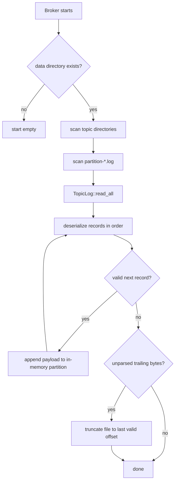
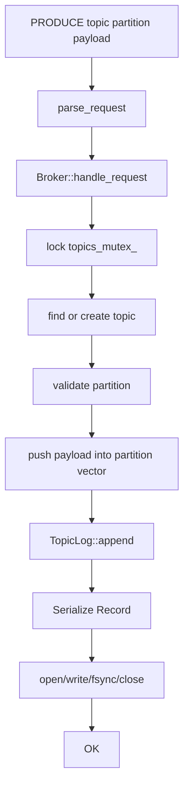
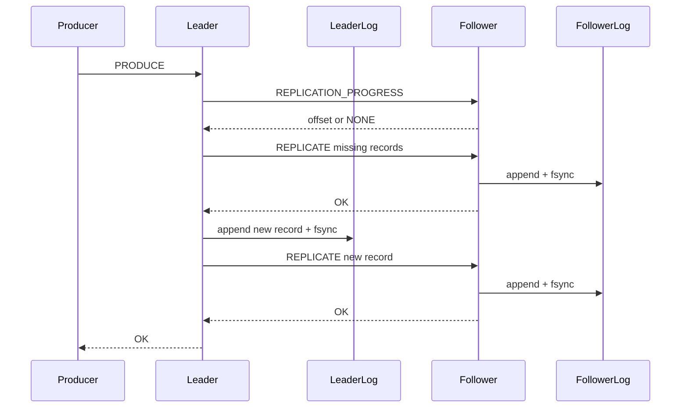

# Storage, Recovery, Partitions, Replication, And Delivery Semantics

This document focuses on durable data representation, startup recovery, partition behavior, consumer delivery behavior, and the simplified replication model.

## Partition Model

The broker uses fixed three-partition topics.

```text
Topic
├── partition 0
├── partition 1
└── partition 2
```

Current public protocol:

```text
PRODUCE <topic> <partition> <payload>
FETCH <topic> <partition> <offset>
```

Partition behavior:

- A topic is auto-created on first valid `PRODUCE`.
- New topics are initialized with partitions `0`, `1`, and `2`.
- Producers choose the partition explicitly.
- Offsets are zero-based indexes within one partition.
- Ordering is only per partition.
- There is no global ordering across partitions.
- `FETCH` returns messages from one partition starting at one offset.

Storage layout:

```text
data/
└── <topic>/
    ├── partition-0.log
    ├── partition-1.log
    └── partition-2.log
```

The broker can also be started with a custom data directory:

```text
./build/kafka-broker <port> <data-directory> <leader|follower> [follower-port]
```

## Record Representation

In memory, a record is represented by:

```cpp
struct Record
{
    std::string payload;
};
```

On disk, each record is serialized as:

```text
[4-byte big-endian payload length][payload bytes][4-byte big-endian CRC32]
```

### Byte Ordering

Both the payload length and CRC are stored in network byte order, which is big-endian:

- Length: `htonl(payload.size())`
- CRC: `htonl(checksum)`

### Payload Length

The length field is a 32-bit unsigned integer containing the number of payload bytes. It does not include the 4-byte length field or the 4-byte CRC field.

### Payload

The payload is stored as raw bytes from the current `std::string`. The public text protocol does not provide escaping or arbitrary binary payload handling, so practical payloads are text payloads sent after the command fields.

### CRC32

CRC32 is calculated over:

```text
[serialized 4-byte length][payload bytes]
```

It does not include the CRC field itself.

## Serialization

`serialize_record()` in `src/record.hpp`:

1. Converts payload size to 4-byte big-endian.
2. Appends the length bytes.
3. Appends payload bytes.
4. Computes CRC32 over length bytes plus payload.
5. Converts CRC to 4-byte big-endian.
6. Appends CRC bytes.

## Deserialization

`deserialize_record()`:

1. Reads 4 length bytes at the current buffer offset.
2. Converts length from big-endian.
3. Verifies the full payload exists.
4. Verifies the 4-byte CRC exists.
5. Recomputes CRC32 over length bytes plus payload.
6. Compares computed CRC to stored CRC.
7. Only on success assigns `out_record.payload`.
8. Advances the caller's offset to the next record boundary.

If any step fails, deserialization returns `false` and does not advance the offset.

## Append Behavior

`TopicLog::append()`:

1. Creates `data_dir/topic` if needed.
2. Serializes the record.
3. Opens the log file with `O_WRONLY | O_CREAT | O_APPEND`.
4. Repeatedly calls `write()` until all serialized bytes are written.
5. Retries interrupted writes on `EINTR`.
6. Calls `fsync()` and retries on `EINTR`.
7. Closes the file descriptor.

Durability claim:

- A successful `TopicLog::append()` means the implementation called `fsync()` successfully on that file descriptor.
- The project does not claim full Kafka durability semantics, disk-controller guarantees, replication quorum durability, or transactional guarantees.

## Startup Recovery



`Broker::recover_from_disk()`:

- Stores the configured data directory in `data_dir_`.
- Skips recovery if the directory does not exist.
- Scans topic directories.
- Scans `.log` files named `partition-<id>.log`.
- Rebuilds `Topic` and `Partition` state from `TopicLog::read_all()`.
- If the broker is a follower, initializes replication progress for recovered non-empty partitions to `records.size() - 1`.

## Incomplete And Corrupt Final Records

Recovery matters because a broker can crash after writing only part of a record or after bytes are corrupted.

Handled cases:

- Missing or partial length field.
- Missing or partial payload.
- Missing or partial CRC.
- CRC mismatch.

Current behavior:

- Accept all valid records before the invalid region.
- Stop at the first invalid record.
- Truncate the file to the last valid record boundary.
- Do not scan forward looking for later valid records.
- Do not reconstruct partial payloads.

## PRODUCE And Storage



Important detail: the current code appends to the in-memory vector before calling `TopicLog::append()`. If `TopicLog::append()` throws, the exception propagates out of the produce path and the in-memory append is not explicitly rolled back.

## FETCH And Storage

`FETCH` reads from in-memory state:

1. Lock `topics_mutex_`.
2. Find topic.
3. Validate partition.
4. Read `topic.partitions[partition].messages`.
5. If offset is past the end, return an empty response.
6. Otherwise return newline-separated messages from offset to the end.

The broker does not reread the log file for each fetch. Logs are used for append and startup recovery.

## Consumer Delivery Semantics

The current consumer behavior is at-least-once-style, not exactly-once.

### Producer Succeeds

For a standalone leader without a follower:

- `OK` means the broker accepted the request and `TopicLog::append()` completed, including `fsync()`.

For a leader with a follower configured:

- `OK` means local append completed and the follower returned `OK` for the corresponding `REPLICATE` request.

### Consumer Receives A Message

`FETCH` returns messages but does not change committed group progress.

### Consumer Crashes Before Committing

If a consumer receives records and crashes or disconnects before `COMMIT`, the committed group offset remains unchanged. Those records can be delivered again.

### Consumer Commits

`COMMIT <group> <consumer_id> <topic> <partition> <offset>` stores the offset in memory under:

```text
group id + topic + partition
```

The offset represents the next offset the group should fetch.

### Consumer Restarts

If the broker process is still running and group offset state remains in memory, a consumer in the group can continue from the last committed offset after joining and polling.

If the broker process restarts, committed group offsets are lost. The topic logs are recovered, but group progress is not. A group with no committed offset begins at offset `0`.

### Semantics Label

The consumer side is at-least-once-style because duplicate delivery is possible after fetch-before-commit failure.

Not implemented:

- Exactly-once semantics.
- Transactions.
- Idempotent producer sequence numbers.
- Persistent committed offsets.
- Offset replication.

## Replication Model

Stage 10 implements simplified synchronous leader/follower replication.



### Leader

A leader with `follower_port_ > 0`:

- Synchronizes existing non-empty partitions before a new produce.
- Does not currently branch on the boolean result of that pre-produce synchronization call in `Broker::handle_request()`.
- Appends the new record locally.
- Sends the new record to the follower.
- Waits for `OK`.

### Follower

A follower:

- Accepts `REPLICATE`.
- Rejects normal leader-only assumptions.
- Appends replicated payloads to its local log.
- Updates `replication_progress_` after successful append.
- Answers `REPLICATION_PROGRESS`.
- Does not independently verify that the supplied replicated offset is exactly the next local offset.

### Replication Progress

Progress is tracked per `TopicPartition` as the latest replicated offset. On follower restart, progress is reconstructed from recovered records:

```text
records.size() - 1
```

No separate replication metadata file exists.

### Missing-Record Detection And Catch-Up

The leader queries follower progress. `get_missing_records()` returns local payloads after that progress. `catch_up_follower()` sends them in offset order as `REPLICATE` requests.

Catch-up is triggered by the next leader `PRODUCE`; there is no background synchronization manager.

### Manual Promotion

`Broker::promote_to_leader()`:

- Sets role to leader.
- Clears old follower configuration.
- Leaves recovered topics, partitions, logs, and in-memory data intact.
- Allows future local `PRODUCE` requests.

There is no runtime TCP command for promotion in the current implementation.

### Replication Limitations

Not implemented:

- Automatic leader election.
- Automatic failure detection.
- Heartbeats.
- Quorum consensus.
- ISR.
- Raft/KRaft.
- Controller.
- Client redirection after promotion.
- Replication retry queue.
- Consumer-offset replication.
- Rollback of a leader local append if follower replication fails.
- Branching on failed pre-produce catch-up before accepting the new local produce.

## Metrics And Benchmark Storage

Metrics are in memory only and reset on broker process restart.

The Stage 11 benchmark artifacts are stored under:

```text
benchmark-results/
├── tcp_vs_epoll_concurrency.csv
└── tcp_vs_epoll_analysis/
    ├── tcp_vs_epoll_concurrency_summary.csv
    ├── throughput_vs_concurrency.png
    ├── p50_latency_vs_concurrency.png
    ├── p95_latency_vs_concurrency.png
    └── p99_latency_vs_concurrency.png
```

Benchmark result files are evidence artifacts. They should not be changed unless a new benchmark is intentionally run and documented.
